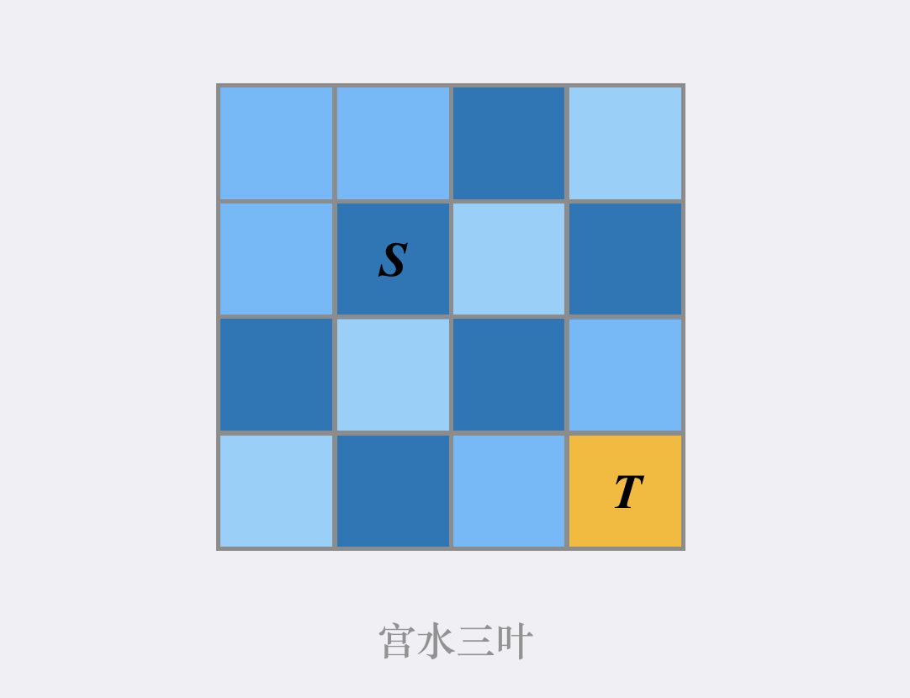
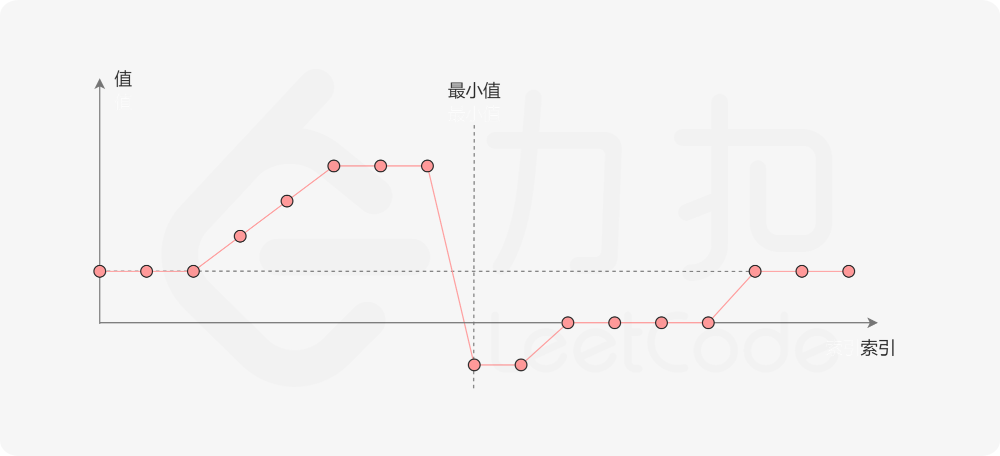
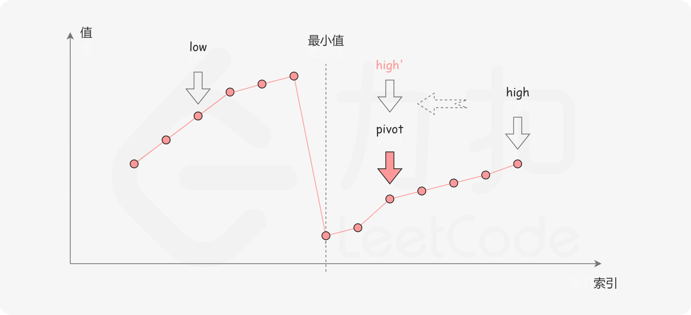

# LC

## 2280. 表示一个折线图的最少线段数

避免浮点运算，就没有误差．

## 2279. 装满石头的背包的最大数量（贪心）

## 2278. 字母在字符串中的百分比

## 2258. 逃离火灾（正向 BFS ，反向 Dijkstra） ⭐️

正向 BFS ，计算每个位置着火的时间，得到 fire ．

反向 Dijkstra ，反推最迟到达时间，得到 late ．

- Time: $\mathcal{O}(mn)$
- Space: $\mathcal{O}(mn)$

## 2138. Divide a String Into Groups of Size k

## 1823. 找出游戏的获胜者（约瑟夫问题、DP） ⭐️

[官方题解](https://leetcode.cn/problems/find-the-winner-of-the-circular-game/solution/zhao-chu-you-xi-de-huo-sheng-zhe-by-leet-w2jd/)

在 $k'$ 出圈后，还有 $n-1$ 个数，问题转化为从 $k'+1$ 开始的 $f(n-1,k)$ ．

$$
f(n,k)=(f(n-1,k)+k'-1)\mod n + 1
$$

## 1768. 交替合并字符串

## 1679. K 和数对的最大数目（双指针）

## 1568. 使陆地分离的最少天数（Tarjan 算法） ⭐️

## 1480. 一维数组的动态和（前缀和）

## 1476. 子矩形查询（历史记录、矩阵） ⭐️

把每次更新记录下来，而不是直接去更新矩阵．

## 1461. 检查一个字符串是否包含所有长度为 K 的二进制子串（哈希） ⭐️

记录所有长度为 k 的子串对应的数．

- 时间复杂度：$\mathcal{O}(n)$
- 空间复杂度：$\mathcal{O}(2^k)$

**有些题目的空间复杂度可以是指数复杂度．**

## 1419. 数青蛙（模拟）

### 队列模拟

用 5 个队列记录应该叫出某个字符的青蛙的编号．

### 计数模拟

上面的方法太“模拟”了，实际上只有队列的长度有用．

这个问题的性质是，如果一个青蛙应该叫出“r”，那么不管哪个已经叫出“c”的青蛙叫出了这个“r”都可以．

## 1379. 找出克隆二叉树中的相同节点（二叉树）

同步深搜．

## 1342. 将数字变成 0 的操作次数

## 1302. 层数最深叶子节点的和（树的遍历、深搜）

## 1218. Longest Arithmetic Subsequence of Given Difference (DP)

## 1209. Remove All Adjacent Duplicates in String II (stack based solution)

A stack is useful because it allow us to simulate removing substrings without actually having to alter the string. This can be done by storing the substrings in `s` , and removing them once their length reaches `k`. Note also that once a substring is removed, we automatically get accesss to the previous substring, hence automatically 'concatenating' the left and the right substrings.

## 1192. 查找集群内的「关键连接」（Tarjan 算法） ⭐️

## 1027. Longest Arithmetic Subsequence (DP)

最长等差子序列．

## 1021. 删除最外层的括号

## 965. 单值二叉树

## 961. 在长度 2N 的数组中找出重复 N 次的元素（哈希、随机选择、数学） ⭐️

### 哈希表

### 数学

- 如果 $n = 4$ ，那么重复的数字最多间隔 2 个位置．
- 如果 $n > 4$ ，那么重复的数字最多间隔 1 个位置．

### 随机选择

直接随机选择 2 个不同的下标，看是否相等．

选择两个相同元素的概率为：

$$
\cfrac{n}{2n} \times \cfrac{n-1}{2n} \approx \cfrac{1}{4}
$$

因此期望选择 4 次结束．

## 953. 验证外星语词典（自定义排序）

## 944. 删列造序

直接遍历．

## 942. 增减字符串匹配（贪心） ⭐️

考虑 `perm[0]` ：

- `s[0] = 'I'` ：令 `perm[0] = 0` ，那么无论 `perm[1]` 是多少都满足 `perm[0] < perm[1]` ．
- `s[0] = 'D'` ：令 `perm[0] = n` ，那么无论 `perm[1]` 是多少都满足 `perm[0] > perm[1]` ．

确定好 `perm[0]` 后，剩余的 $n−1$ 个字符和 $n$ 个待确定的数就变成了一个和原问题相同，但规模为 $n−1$ 的问题。

当只剩一个数时，直接填入即可．

## 937. 重新排列日志文件（自定义排序）

自定义排序．

官方题解：「数字日志保留原来的相对顺序。当使用稳定的排序算法时，可以认为所有数字日志大小一样。当使用不稳定的排序算法时，可以用日志在原数组中的下标进行比较。」

尽量用 C 的字符串操作可以避免拷贝，提高性能，节省内存．

C++ 20 的 `string_view` 和 `<=>` 也可以，但是 LeetCode 目前只支持 C++ 17 ．

## 867. 转置矩阵

## 812. 最大三角形面积（凸包、多边形面积、计算几何） ⭐️

1. 三角形的三个点一定在凸包上，可以反证．所以只要在在凸包上组合枚举 a, b, c （即不考虑顺序，所以可以令 a < b < c）．
2. 本题的凸包不需要考虑共线（见笔记），但要求凸包的点一定是顺时针或逆时针的．
3. 在确定了 ab 之后， c 与三角形面积的关系是一个凸函数，面积的最大值在 c = 极点时取得．
4. 在确定了 a 之后，如果 b 从小到大枚举，则函数的极点也一定会增大，于是 c 不必再从 b 枚举，而只须从上次取得极点的位置开始枚举，这一优化将时间复杂度从 $\mathcal{O}(n^3)$ 降到了 $\mathcal{O}(n^2)$ ．

## 713. 乘积小于 K 的子数组（滑动窗口） ⭐️

滑动窗口是常用技巧了，窗口右侧尽可能向右扩张，不满足条件时左侧还要向右收缩．

要搞明白的点是如何通过维持这个窗口来得到答案．

假设目前右侧移动一个位置（然后左侧可能需要相应地移动若干位），那么由于这个窗口大小的变化而新增的子数组一定要包括最右侧这个数，所以新增的子数组数就是 `r - l` ．

## 699. 掉落的方块 ⭐️

### 有序集合

`map` 作为有序集合的数据结构．

### 动态开点线段树

题解来自[「宫水三叶」](https://leetcode.cn/problems/falling-squares/solution/by-ac_oier-zpf0/)．

具体的，我们将顺序放置方块的操作（假设当前方块的左端点为 $a$，边长为 $len$，则有右端点为 $b=a+len$ ），分成如下两步进行：

- 查询当前范围 $[a,b]$ 的最大高度为多少，假设为 $cur$；
- 更新当前范围 $[a,b]$ 的最新高度为 $cur+len$。

**因此这本质上是一个「区间修改 + 区间查询」的问题，我们需要实现带「懒标记」的线段树，从而确保在进行「区间修改」时复杂度仍为 $O(logn)$．**

另外有一个需要注意的细节是：不同方块之间的边缘可以重合，但不会导致方块叠加，因此我们当我们对一个区间 [a,b] 进行操作（查询或插入）时，可以将其调整为 [a,b−1]，从而解决边缘叠加操作高度错误的问题。

## 691. 贴纸拼词（记忆化搜索、状态压缩） ⭐️

因为是找 sticker 的组合，而这道题每一种 sticker 有无限个，要是不能有效剪枝就会状态数爆炸．

官解的剪枝策略是，如果某个新加的贴纸不能让当前的 mask 变得更小，就不再计算了．

另外，这种题应该没有贪心的解法，本质上只能暴力枚举，就看怎么剪枝了．

## 675. 为高尔夫比赛砍树（BFS、A*） ⭐️

题解来自「[宫水三叶](https://leetcode.cn/problems/cut-off-trees-for-golf-event/solution/by-ac_oier-ksth/)」．

### BFS

网格图只要 BFS 就能计算出最短路，时间复杂度为 $\mathcal{O}(m^2n^2)$．

### A*

由于问题的本质是求最短路，同时原问题的边权为 1，因此套用其他复杂度比 BFS 高的最短路算法，对于本题而言是没有意义（dijkstra 的时间复杂度为 $\mathcal{O}(m^2n^2\log mn)$），但运用启发式搜索 AStar 算法来优化则是有意义。

因为在 BFS 过程中，我们会无差别往「四联通」方向进行搜索，直到找到「当前树点的下一个目标位置」为止，而实际上，两点之间的最短路径往往与两点之间的相对位置相关。

举个 🌰，当前我们在位置 S，我们目标位置是 T，而 T 在 S 的右下方，此时我们应当优先搜索方向"往右下方"的路径，当无法从"往右下方"的路径到达 T，我们再考虑搜索其他大方向的路径：

  

如何设计这样带有优先级的搜索顺序，则是 AStar 算法「启发式函数」的设计过程，其本质是对应了对「最小步数」的估算，只有当我们确保「最小步数估算 <= 实际最小步数」，AStar 算法的正确性才得以保证。

因此我们往往会直接使用「理论最小步数」来作为启发式函数的，对于本题，可直接使用「曼哈顿距离」作为「理论最小步数」。

因此，如果我们是要从源点 S 到汇点 T，并且当前位于中途点 x 的话，点 x 的最小步数估算包括两部分：到点 x 的实际步数 + 从点 x 到点 T 的理论最小步数（曼哈顿距离）。使用「优先队列」按照「总的最小步数估算」进行出队，即可实现 AStar 算法的搜索顺序。

另外，启发式函数的设计是针对汇点而言的，因此 AStar 算法搜索过程只确保对 T 的出入队次序能够对应回到点 T 第 k 短路，而对于其余点的出入队次序到其余点的最短路没有必然的对应关系，因此当某个点的最小步数被更新，我们是要将其进行再次入队的。

### 并查集处理无解

可用并查集判断源点和其他点之间的联通性，从而判断是否有解，只有在有解的情况下才使用 BFS 或 A* 进一步求解．

## 668. 乘法表中第 k 小的数（二分查找） ⭐️

1. 反向问题：对于乘法表中的数字 x，它是乘法表中第几小的数字？
2. 计算出公式，发现关于 x 单调．
3. 二分查找．

## 591. 标签验证器（递归下降子程序、栈的应用） ⭐️

递归下降子程序还是比较通用的方法，从代码量上看其实和栈的方法也没差多少．

如果理解了递归下降子程序，应该也可以顺利写出栈的版本．虽然栈的版本可以进一步优化，但是我选择 cv ．

## 587. 安装栅栏（凸包、计算几何） ⭐️

见笔记，本题的凸包是考虑共线的点的．

## 473. 火柴拼正方形（DFS、动态规划） ⭐️

## DFS

### 剪枝 1

边没有顺序，如果两条边当前填入火柴的总长度相同，不必再次深搜．

在这道题中下面这种剪枝方法更快：

```cpp
if (i > 0 and edges[i] == edges[i - 1]) {
   continue;
}
```

即只判断上条边的长度．

### 剪枝 2

从大的火柴开始放更容易放满．

## 动态规划 + 状态压缩

1. **人为规定一条边一条边放，只有一条边放满了才放下一条边**．
2. 用一个 `int` 表示当前状态 s ：第 k 位表示是否选择了第 k 根火柴．
3. `dp[s]` 表示在状态 s 中，当前正在放的那条边的长度，`dp[s]=-1` 表示按照 1 的规则不可能达到状态 s ．

## 468. 验证IP地址

## 467. 环绕字符串中唯一的子字符串（DP、子串） ⭐️

**由于 $s$ 是周期字符串，对于在 $s$ 中的子串，只要知道子串的第一个字符（或最后一个字符）和子串长度，就能确定这个子串．**例如子串以 ‘d’ 结尾，长度为 3 ，那么该子串为 “bcd”．

题目要求不同的子串个数，那么对于两个以同一个字符结尾的子串，长的那个子串必然包含短的那个。例如 “abcd” 和 “bcd” 均以 ‘d’ 结尾，“bcd” 是 “abcd” 的子串。

**据此，我们可以定义 $dp[α]$ 表示 $p$ 中以字符 $α$ 结尾且在 $s$ 中的子串的最长长度，知道了最长长度，也就知道了不同的子串的个数。**

如何计算 $dp[α]$ 呢？**我们可以在遍历 $p$ 时，维护连续递增的子串长度 $k$** 。具体来说，遍历到 $p[i]$ 时，如果 $p[i]$ 是 $p[i−1]$ 在字母表中的下一个字母，则 $k=k+1$，否则 $k=1$ ，表示重新开始计算连续递增的子串长度。然后，用 $k$ 更新 $dp[p[i]]$ 的最大值。

遍历结束后，$p$ 中以字符 $c$ 结尾且在 $s$ 中的子串有 $dp[c]$ 个。例如 $dp[‘d’]=3$ 表示子串 “bcd”、“cd” 和 “d”。

最后答案为

$$
\sum_{\alpha='a'}^{'z'}dp[\alpha]
$$

## 464. 我能赢吗（博弈、记忆化搜索） ⭐️

1. 状态压缩
2. dfs 的含义是「当前状态先手能否取胜」．

## 462. 最少移动次数使数组元素相等 II（快速选择算法） ⭐️

1. 假设数组元素都变成 $x$ 时，所需移动数最少，首先求出 $x$ ．

   为简化讨论，假设数组长度为偶数．

   首先将数组排序后进行首尾配对，形成 $\lfloor\cfrac{n}{2}\rfloor$ 个区间：

   $$
   [n_0,n_{n-1}],\ [n_1,n_{n-2}],\ [n_2,n_{n-3}],\cdots ,[n_{\frac{n}{2}-1},n_{\frac{n}{2}}]
   $$

   当 $x$ 同时位于以上区间内时，所需移动数最少．在上述区间内，后一个区间是前一个区间的子集，因此只要 $x\in [n_{\frac{n}{2}-1},n_{\frac{n}{2}}]$ $．

   当数组长度为奇数时，最后一个区间为 $x\in [n_{\frac{n}{2}},n_{\frac{n}{2}}]$ ，结论不变，因此可以取 $x=n_{\lfloor\frac{n}{2}\rfloor}$ ．

2. 利用快速选择算法，可在线性时间内求出数组中第 $\lfloor\cfrac{n}{2}\rfloor$ 小的数．

## 456. 132 Pattern （前缀数组、单调栈） ⭐️

思路和代码来自大佬[「白」](https://leetcode.cn/u/vclip/)．

这道题的要求可以分成两步：

1. 在 $[0, k)$ 中找一个 $j$ ，满足 $nums[k] < nums[j]$
2. 在 $[0, j)$ 中找一个 $i$ ，满足 $nums[k] > nums[i]$

据此设计数据结构：

1. 为了尽可能找到 $i$ ，要求 $j$ 要尽可能大，即 $j$ 应该是 $k$ 左侧第一个满足 $nums[k] < nums[j]$ 的位置，维护这个位置，可以用单调栈．
2. 在确定了 $j$ 之后，只要看 $[0, j)$ 中的最小值是否小于 $nums[k]$ 即可，维护 $[0, j)$ 的最小值可以用前缀数组．

## 450. 删除二叉搜索树中的节点（BST） ⭐️

### 递归

如果要删除的结点有两个孩子，这时只能把中序前驱 / 后继的值复制过来，然后递归删除．

但是在 Java 中，由于不需要手动 delete ，没有这个问题．

### 递归改进

只在有一个孩子时递归，在有两个孩子时迭代．

### 迭代

迭代的问题是需要记录父节点，代码比较长

### 二级指针迭代

思路来自「[梦璃夜·天星](https://leetcode.cn/u/muriyatensei/)」．

写法简洁．

而且用了另一种写法：不再是用中序后继替换要删除的节点，而是把要删除的节点的左子树放在中序后继的左孩子上，问题转化为只有右孩子的情况，用右孩子替换要删除的结点即可．

## 448. 找到所有数组中消失的数字（原地哈希） ⭐️

## 标记为负数

## 标记为比 n 大的数

由于这道题的数都在 [1, n] 之间，所以可以每遇到一个数 x 就把 nums[x - 1] 加 n ，来表示出现过．

## 442. 数组中重复的数据（原地哈希） ⭐️

### 原地交换数组

### 标记为负数

## 436. 寻找右区间（二分查找、双指针） ⭐️

### 二分查找

按照左边界排序，然后二分．

- `lower_bound` ：首个 $≥$ 的迭代器．
- `upper_bound` ：首个 $>$ 的迭代器．
- 如果有多个相同的元素，那么这个元素的区间为 $[lower, upper)$ ．

### 双指针

分别按照左右边界排序，然后双指针．

## 433. Minimum Genetic Mutation (BFS)

1. DNA 的位序可以当做编码．
2. 预处理出 `adj` ．

## 420. 强密码检查器（贪心） ⭐️

[【Sheep】420. 强密码检验器（贪心）](https://leetcode.cn/problems/strong-password-checker/solution/si-lu-qing-xi-c-0ms-by-13261896688/)

分别考虑三种修改方式在三个方面的影响．

## 329. 矩阵中的最长递增路径（记忆化搜索、拓扑排序、最长路径、动态规划） ⭐️

在这道题中，路径长度定义为路径中的单元格的个数，所以最小为 1．

直接深搜时间复杂度为 $\mathcal{O}(m^2n^2)$ ，应该过不了．

### dijkstra

dijkstra 记录当前的最远距离，可以得出正确答案，但是格子由于可能会多次入队，比较慢．

### 动态规划

1. 记忆化 dfs ．
2. bfs 也行，但是要按照一定的顺序转移状态（否则就变成 dijkstra 了）．
   1. 拓扑排序：从当前出度为 0 的格子转移状态．
   2. 按照单元格的值排序：从大到小或者从小到大都行，只要状态转移的匹配．

> 「变式」给定一个整数矩阵，找出符合以下条件的路径的数量：这个路径是严格递增的，且它的长度至少是 3。矩阵的边长最大为 $10^3$ ，答案对 $10^9+7$ 取模。其他条件和题目相同。思考：是否可以借鉴这道题的方法？

**表示连通性的邻接矩阵 $A$（路径长度均为 1）的 $k$ 次幂 $A^k$ 中的元素 $a_{ij}$ 表示从 $i$ 到 $j$ 的长度为 $k$ 的路径条数．**但是这个变式中的数据范围太大了．

本题利用拓扑排序计算出最长的路径，实际上拓扑排序可以计算出任意长度的路径数．

### 拓扑排序

「基于出度的概念，可以使用拓扑排序求解。从所有出度为 0 的单元格开始广度优先搜索，每一轮搜索都会遍历当前层的所有单元格，更新其余单元格的出度，并将出度变为 0 的单元格加入下一层搜索。当搜索结束时，搜索的总层数即为矩阵中的最长递增路径的长度。」

拓扑排序可以看成 dijkstra 的优化． 但是每个格子会多次入队．而拓扑排序后直接 bfs ，每个格子只入队一次．

## 322. 零钱兑换（DP、完全背包） ⭐️

## 318. 最大单词长度乘积（位运算、哈希） ⭐️

## 307. 区域和检索 - 数组可修改（RMQ 问题） ⭐️

## 304. 二维区域和检索 - 矩阵不可变（二维前缀和） ⭐️

## 303. 区域和检索 - 数组不可变（前缀和）

## 295. 数据流的中位数（优先队列、有序集合） ⭐️

## 292. Nim 游戏（博弈、数学） ⭐️

1. 只要拿完之后剩 4 块，那就必胜了，因为对手无法全拿走 4 块，所以最后一块一定是我拿的．
2. 往前推，只要拿完之后剩 8, 12, 16 ... 块，那就必胜了．
3. 所以只要第一次玩完之后，剩余 4 的倍数就必胜．
4. 也就是只要石头总数不是 4 的倍数，那就必胜．

## 269. 火星词典（拓扑排序、DFS、BFS） ⭐️

这道题是拓扑排序问题。火星词典中的字母和字母顺序可以看成有向图，字典顺序即为所有字母的一种排列，满足每一条有向边的起点字母和终点字母的顺序都和这两个字母在排列中的顺序相同，该排列即为有向图的拓扑排序。

### DFS

### BFS

## 268. 丢失的数字 ⭐️

### 交换

### 排序

### 哈希

### 位运算

异或

### 数学

求和

## 255. 验证前序遍历序列二叉搜索树（单调栈） ⭐️

思路来自 [yuruiyin](https://leetcode.cn/problems/verify-preorder-sequence-in-binary-search-tree/solution/java-liang-chong-jie-fa-by-npe_tle/)．

维护一个单调递减栈（从栈底到栈顶），如某一状态下栈元素为 `[5,4,3]` 。若碰到一个 6 的时候，说明从左子树（或者没有左子树）到达了右子树，此时将小于 6 的元素都 pop 掉，栈变成 `[6]`,并且记录一个最小值为 5，由于 6 是右子树，因此 6 右侧的元素都必须大于 5，否则不合法。

## 236. 二叉树的最近公共祖先（二叉树） ⭐️

## 235. 二叉搜索树的最近公共祖先（二叉树） ⭐️

## 226. 翻转二叉树（二叉树）

## 225. 用队列实现栈（队列、栈）

### 两个队列

为了满足栈的特性，即最后入栈的元素最先出栈，在使用队列实现栈时，应满足队列前端的元素是最后入栈的元素。可以使用两个队列实现栈的操作，其中 queue1 用于存储栈内的元素， queue2 作为入栈操作的辅助队列。

#### 一个队列

入栈操作时，首先获得入栈前的元素个数 n，然后将元素入队到队列，再将队列中的前 n 个元素（即除了新入栈的元素之外的全部元素）依次出队并入队到队列，此时队列的前端的元素即为新入栈的元素，且队列的前端和后端分别对应栈顶和栈底。

#### [模拟链表](<https://leetcode.com/problems/implement-stack-using-queues/discuss/62522/O(1)-purely-with-queues>)

another crazy idea.

## 215. 数组中的第 K 个最大元素（快速选择算法） ⭐️

## 216. 组合总和 III ⭐️

### 子集枚举

### 二进制枚举

## 191. 位1的个数（归并、位运算） ⭐️

### 归并

### 优化的归并

### `n & (n - 1)`

这个操作会把最低位的 1 变成 0 .

`n-1` 会导致从最低位开始的 0 全变成 1 ，直到遇到一个 1 ，把这个 1 变成 0 ．

### 内置函数

## 160. 相交链表（链表、双指针） ⭐️

## 154. 寻找旋转排序数组中的最小值 II（二分查找） ⭐️

  
  


「第三种情况是 `nums[pivot]==nums[high]` 。如下图所示，由于重复元素的存在，我们并不能确定 `nums[pivot]` 究竟在最小值的左侧还是右侧，因此我们不能莽撞地忽略某一部分的元素。我们唯一可以知道的是，由于它们的值相同，所以无论 `nums[high]` 是不是最小值，都有一个它的「替代品」`nums[pivot]`，因此我们可以忽略二分查找区间的右端点。」


## 153. 寻找旋转排序数组中的最小值（二分查找） ⭐️

  
  


## 151. 颠倒字符串中的单词（字符串） ⭐️

可以原地颠倒：

1. 整体翻转
2. 对每个单词翻转

## 121. 买卖股票的最佳时机（DP）

## 117. 填充每个节点的下一个右侧节点指针 II（树的层序遍历） ⭐️

记录队列的长度，然后每次直接取出一层．

## 110. 平衡二叉树（二叉树）

## 105. 从前序与中序遍历序列构造二叉树（二叉树） ⭐️

## 104. 二叉树的最大深度（二叉树）

## 101. 对称二叉树（二叉树）

## 79. 单词搜索（回溯、DFS） ⭐️

## 70. 爬楼梯

## 64. 最小路径和（DP）

## 63. 不同路径 II（DP）

## 62. 不同路径（离散数学、组合数） ⭐️

要走 $m+n-2$ 步，从其中选择 $m-1$ （$n-1$）步向下（右）走．于是就是计算组合数了．

组合数是成对出现的，它们的值相同，首先要选那个比较好算的．

计算的技巧是每次乘一个数再除一个数，从大的开始乘，从小的开始除，一定能整除，中间结果也不至于过大．

## 61. 旋转链表（链表） ⭐️

1. 连成一个环
2. 找到应该断开的位置
3. 断开

## 53. 最大子数组和（DP）

## 50. Pow(x, n)（快速幂） ⭐️

我写的是规定 $0^0=1$ ．

如果不用 `long long` 的话，就要处理最小值的情况．

### 迭代

### 递归

## 47. 全排列 II（组合数学、可重集全排列） ⭐️

首先 sort ，把重复的数字放在一起，然后用一个 vis 数组记录哪些数被选过了．为了避免在一个位置上选重复的数字，规定重复的数字只能按顺序拿，比如 [... a, b, c ...] ，其中 a = b = c ，那么只有 a 被拿了才能拿 b ，a 和 b 都被拿了才能拿 c ．

## 29. 两数相除（二分查找、指数二分查找） ⭐️

### 二分查找

#### 考虑边界情况

1. 被除数为最小值、0
2. 除数为最小值、1、-1
3. 不需要考虑最大值是因为最小值的绝对值比最大值大 1 ．

#### 考虑一般情况

可以先确定结果的正负，然后在运算时统一运算数的正负．但是要将正数变为负数，因为由于
`int` 的范围，如果反过来可能会溢出．下面就只考虑运算数都是负数的情况了．

#### 推导公式

$X/Y=Z$ ，则 $ZY≥X≥(Z+1)Y$ ，即要找到最大的满足条件的 $Z$ ，从而确定使用二分查找（$Z$ 是正数）．

#### 实现乘法

利用「快速乘」实现乘法．

#### 考虑细节

##### 二分查找的界

1. 下界为 1 ， 上界为 $2^{31}-1$
2. 结果为 $2^{31}$ （上溢）的情况已经在边界中考虑过．
3. 如果二分查找失败，那么答案一定是 0 ．

##### 快速乘时避免溢出

1. 快速乘的目的是判断 $ZY≥X$ 是否成立．如果判断 $ZY<X$ ，避免溢出会更加复杂．
2. 将判断 $A+B<C$ 改为等价但不会溢出的 $A<B-C$ （均为负数）．

#### 时间复杂度

二分 * 快速乘 = $\mathcal{{O}}(\log^2C)$ ，C 是 `int` 的范围．

### 指数二分查找

常规意义下的二分查找为：给定区间 $[l,r]$，取该区间的中点 $mid=\cfrac{⌊l+r⌋}{2}$，根据 $mid$ 处是否满足某一条件，来决定移动左边界 $l$ 还是右边界 $r$ ．

我们也可以考虑另一种二分查找的方法：

- 记 $k$ 为满足 $2^k≤r−l<2^{k+1}$ 的 $k$ 值。
- 二分查找会进行 $k+1$ 次。在第 $i (1≤i≤k+1)$ 次二分查找时，设区间为 $[l_i,r_i]$，我们取 $mid=li+2^{k+1−i}$ 如果 $mid$ 不在 $[l_i,r_i]$ 的范围内，那么我们直接忽略这次二分查找；
- 如果 $mid$ 在 $[l_i,r_i]$ 的范围内，并且 $mid$ 处满足某一条件，我们就将 $l_i$ 更新为 $mid$，否则同样忽略这次二分查找。

最终 $l_i$ 即为二分查找的结果。这样做的正确性在于：

设在常规意义下的二分查找的答案为 $ans$，记 $δ$ 为 $ans$ 与左边界的差值 $ans−l$ ．
$δ$ 不会大于 $r−l$，并且 $δ$ 一定可以用 $2^k,2^{k−1},2^{k−2},⋯,2^1,2^0$ 中的若干个元素之和表示（考虑 $δ$ 的二进制表示的意义即可）。因此上述二分查找是正确的。

基于上述的二分查找的方法，我们可以设计出如下的算法：

- 我们首先不断地将 $Y$ 乘以 2（通过加法运算实现），并将这些结果放入数组中，其中数组的第 $i$ 项就等于 $Y×2^i$ 。这一过程直到 $Y$ 的两倍严格小于 $X$ 为止。
- 我们对数组进行逆序遍历。当遍历到第 $i$ 项时，如果其大于等于 $X$，我们就将答案增加 $2^i$ ，并且将 $X$ 中减去这一项的值。

本质上，上述的逆序遍历就模拟了二分查找的过程。

#### 另一种理解

这种做法通过位运算来逐位确定 $Z$ ．

- 如果 $X \operatorname{MOD} Y = 0$ ，那么 $Z=\cfrac{Y}{X}$ ，显然正确．
- 否则要说明这种算法得到的 $Z^{'}$ 确实是满足条件的 $Z$ ．
    1. 可以取到答案
    2. $Z^{'} > Z$ 是不可能的，这种算法能保证 $Z^{'}Y>=X$ ．
    3. 假设 $Z^{'} < Z$ ，从二进制表示上看 $Z$ 从高位到低位会先出现 $1$ ，而 $Z^{'}$ 没有选，这也是不可能的．

#### 时间复杂度

二分 = $\mathcal{O}(\log C)$

## 21. 合并两个有序链表（链表、递归） ⭐️

### 递归

这题还能递归，两个链表头部值较小的一个节点与剩下元素的 merge 操作结果合并．

### 迭代

需要额外定义一个 header 结点，从而简化链表操作．

## 6. Z 字形变换 ⭐️

## 5. 最长回文子串（DP、Manacher） ⭐️

[官方题解](https://leetcode.cn/problems/longest-palindromic-substring/solution/zui-chang-hui-wen-zi-chuan-by-leetcode-solution/) 中介绍的 Manacher 算法还可以再优化，可以假装插入了 `#` ，而不用真的插入，实际上就是一个字符映射的问题，

映射完成后，所有原字符串上的位置都是奇数，而且「当我们只考虑长度为奇数的回文字符串时，每次我们比较的两个字符奇偶性一定是相同的，所以原来字符串中的字符不会与插入的特殊字符互相比较，不会因此产生问题。」，那么当 `expand` 时，如果两个位置都是偶数，说明是 `#` ，直接判等．

## 4. 寻找两个正序数组的中位数（二分、划分） ⭐️

[官方题解](https://leetcode.cn/problems/median-of-two-sorted-arrays/solution/xun-zhao-liang-ge-you-xu-shu-zu-de-zhong-wei-s-114/)

### 二分查找

1. 在两个有序的数组上求中位数可以转化为求第 $K$ 小的元素问题．
2. 求第 $K$ 小的元素，只要累计删掉 $K - 1$ 个数就行．
3. 但要注意不能删多了，所以每次在每个数组上将第 $K / 2$ 小的数作为的分界点．

### 划分数组

1. 求中位数，可以转化在两个数组上确定一个划分．
2. 由中位数的性质，如果确定了一个数组中的划分位置，另一个数组中的位置也就相应确定了．
3. 所以只需要在一个数组上移动，找到正确的划分位置．
4. 而这个问题仍然是具有单调性质的，所以可以使用二分来确定划分的位置．
5. 这种方法的时间复杂度最小．

## 3. 无重复字符的最长子串（哈希）

哈希记录每个字符上次出现的位置．

## 2. 两数相加（链表的应用）

用链表模拟加法．

## 1. 两数之和（双指针、哈希）

哈希表 ，一边遍历一边更新哈希表就可以，因为总是可以在遇到第 2 个数的时候找到．
